# Aquarien- und Vogelfreunde Fellbach — Association Website & Admin Dashboard Case Study

[](https://react.dev/)
[](https://www.typescriptlang.org/)
[](https://vite.dev/)
[](https://tailwindcss.com/)
[](https://supabase.com/)

A public case study for **Aquarien- und Vogelfreunde Fellbach e.V.**, a modern association website with event management, gallery, guestbook, contact forms and a custom admin dashboard.

> Note: This is a public case-study repository. It documents the project goals, feature scope, design direction and technical approach. The production codebase remains private.

---

## Overview

**Aquarien- und Vogelfreunde Fellbach e.V.** is a local association, also known as **„die kleine Wilhelma"**, with a strong community and a rich club history. The goal was to create a modern digital presence that presents the association’s activities, events, gallery and chronicle in a clear and inviting way.

The project was built as more than a classic club website. It includes an admin dashboard, protected routes, role-based access, event management, gallery management, announcements, messages, guestbook moderation and opening-hours management.

This project was created as a voluntary contribution to support the association and make its work more visible online.

---

## Project Goals

- Create a modern online presence for a traditional local association
- Present events, gallery, chronicle and announcements in a clear structure
- Give the volunteer team the ability to manage content independently
- Add a protected admin dashboard for internal content workflows
- Support role-based access for admin/editor responsibilities
- Provide secure contact and guestbook forms with spam protection direction
- Build a responsive experience for visitors, members and families
- Add privacy, accessibility and GDPR-conscious foundations

---

## Challenge

The association needed a modern digital stage for its club life, history and activities. A static or outdated website would not be enough, because the volunteer team also needed practical tools to update content without technical support.

Main challenges:

- No modern online presence for events, gallery and association history
- Content updates needed to be manageable by the volunteer team
- Events, announcements and images required a structured workflow
- Contact requests and guestbook entries needed moderation and spam protection
- The site needed to be accessible, responsive and easy to use for all visitors

---

## Solution

The solution was a responsive association website with a custom admin dashboard and Supabase-backed content workflows.

The public website presents the association through homepage content, event pages, image gallery, chronicle/timeline, contact area and legal pages. The admin side gives authorized users tools to manage events, gallery images, announcements, messages, users, guestbook entries and opening hours.

Key solution points:

- Modern public association website
- Event calendar and event management
- Image gallery with lightbox direction
- Association chronicle as a timeline
- Guestbook and contact form direction
- Admin dashboard for volunteer content management
- Role-based authentication and protected routes
- Supabase backend, storage and auth direction
- Cookie consent and GDPR-conscious structure

---

## My Role

I handled the full project direction, including:

- UI/UX design direction
- Front-end development
- Responsive implementation
- Component-based page structure
- Admin/dashboard planning and implementation direction
- Event, gallery and chronicle content structure
- Supabase/auth workflow direction
- Privacy, cookie consent and form-spam protection direction
- Deployment and domain-related support

---

## Tech Stack

| Area | Technologies |
| --- | --- |
| Frontend | React, TypeScript, Vite |
| Styling | Tailwind CSS, shadcn/ui, Radix UI |
| Animations | Framer Motion |
| Backend | Supabase |
| Auth | Supabase Auth, protected routes, role-based access direction |
| Forms | React Hook Form, Zod |
| Data Fetching | TanStack Query |
| Routing | React Router |
| UI Enhancements | Lucide React, Recharts, Embla Carousel, Sonner |
| SEO | React Helmet Async, structured content, sitemap direction |
| Testing/Quality | Vitest, Testing Library direction |
| Compliance | Cookie consent, GDPR-focused privacy structure |

---

## Key Features

### Public Association Website

- Homepage for presenting the association
- Events page for upcoming and past activities
- Gallery for images from events, animals and association life
- Chronicle page for the association history
- Contact page for visitor and member inquiries
- Legal pages for Impressum and Datenschutz

### Event Management

- Event calendar direction
- Create, edit and manage events in the admin area
- Public display of association dates and activities
- Structured event content for visitors

### Gallery & Lightbox

- Image gallery direction with categories and filtering
- Lightbox-style image viewing
- Upload and edit workflow in the admin dashboard
- Visual presentation of the association’s activities

### Guestbook & Contact Forms

- Guestbook direction for visitor messages
- Moderation workflow for guestbook entries
- Contact form direction for inquiries
- reCAPTCHA/spam-protection direction

### Admin Dashboard

- Protected dashboard route
- Event management
- Gallery management
- Announcement management
- Messages/inquiries overview
- User management
- Guestbook moderation
- Opening-hours management
- Documentation/admin help section direction

### Security, Privacy & Accessibility

- Role-based access direction for admin/editor workflows
- Supabase authentication direction
- Cookie consent and cookie settings components
- Error boundary structure
- Accessibility helpers, skip-to-content and accessibility panel direction
- GDPR-conscious structure for a German association website

---

## Outcome

The result is a modern, self-manageable association website that supports both public communication and internal volunteer workflows.

Main outcomes:

- Modern digital presence for the association
- Better presentation of events, gallery and chronicle
- Volunteer team can manage content independently
- Structured admin dashboard for everyday updates
- Safer contact and guestbook workflows
- Responsive website for visitors, members and families
- Stronger visibility and accessibility for the association’s work

---

## Design Direction

The design direction is friendly, natural and community-oriented. The website should feel approachable for families, members and visitors while still providing a structured and reliable admin experience for the volunteer team.

Design principles:

- Clear and welcoming visual language
- Nature, water and animal-inspired mood
- Strong readability and accessible spacing
- Mobile-first layout
- Gallery-focused visual storytelling
- Simple navigation for public visitors
- Practical dashboard structure for volunteers

---

## Architecture Notes

The private production project is built with a modern React/Vite architecture and a reusable component system.

The application uses provider-based setup for React Query, theme, auth, site settings, cookie consent and recycle-bin workflows. Routing is separated into public routes, protected admin routes and a catch-all route. The admin side uses protected routes with admin/editor access direction.

---

## Source Code Structure

The production codebase follows a modular React structure. The exact source code remains private, but the architecture is organized around public pages, protected admin pages, reusable components, provider-based app setup, Supabase integration and service layers.

```text
src/
├── components/              # Reusable UI, layout and feature components
│   ├── auth/                # Authentication and protected route components
│   ├── cookies/             # Cookie consent and cookie settings components
│   ├── error/               # Error boundary and recovery UI
│   ├── navigation/          # Scroll and navigation helpers
│   ├── providers/           # AppProviders: query, auth, theme, cookie and site settings
│   ├── routing/             # AppRoutes and route rendering
│   ├── ui/                  # shadcn/ui base components
│   └── maintenance/         # Maintenance mode wrapper
├── contexts/                # Auth, site settings and cookie consent contexts
├── hooks/                   # Custom React hooks and shared state helpers
├── pages/                   # Public route-level pages
│   ├── Index.tsx
│   ├── Termine.tsx
│   ├── Gallery.tsx
│   ├── Chronik.tsx
│   ├── Kontakt.tsx
│   ├── Sitemap.tsx
│   ├── Auth.tsx
│   ├── Maintenance.tsx
│   ├── legal/               # Impressum and Datenschutz pages
│   └── admin/               # Protected admin dashboard pages
│       ├── Dashboard.tsx
│       ├── events/          # Event list, create and edit workflows
│       ├── gallery/         # Gallery list, upload and edit workflows
│       ├── announcements/   # Announcement management
│       ├── messages/        # Contact/message inbox
│       ├── settings/        # Site settings management
│       ├── users/           # User management
│       ├── guestbook/       # Guestbook moderation
│       ├── opening-hours/   # Opening-hours management
│       └── docs/            # Admin documentation/help section
├── routes/                  # Public, admin and catch-all route configuration
├── services/                # API and service functions
├── utils/                   # Data initialization, accessibility and utility helpers
├── integrations/            # Supabase/backend integration layer
├── types/                   # TypeScript types
└── main.tsx                 # Application entry point
```

This structure separates the public association website from protected admin workflows. It keeps the project maintainable while supporting events, gallery content, chronicle pages, contact forms, guestbook moderation and association management tools.

---

## Screenshots

### Desktop Homepage

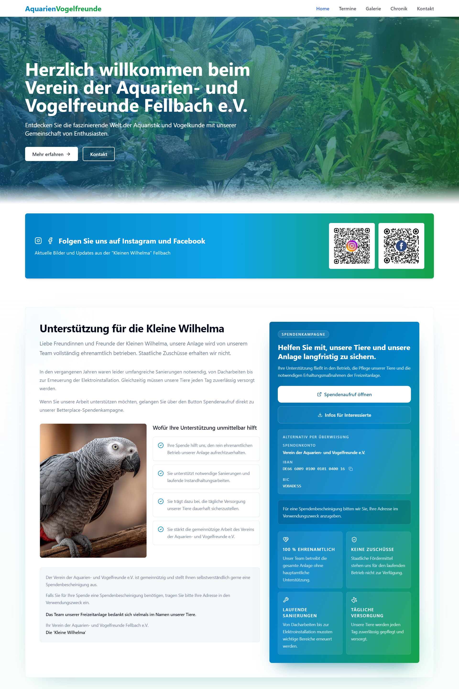

<table>
  <tr>
    <td width="50%">
      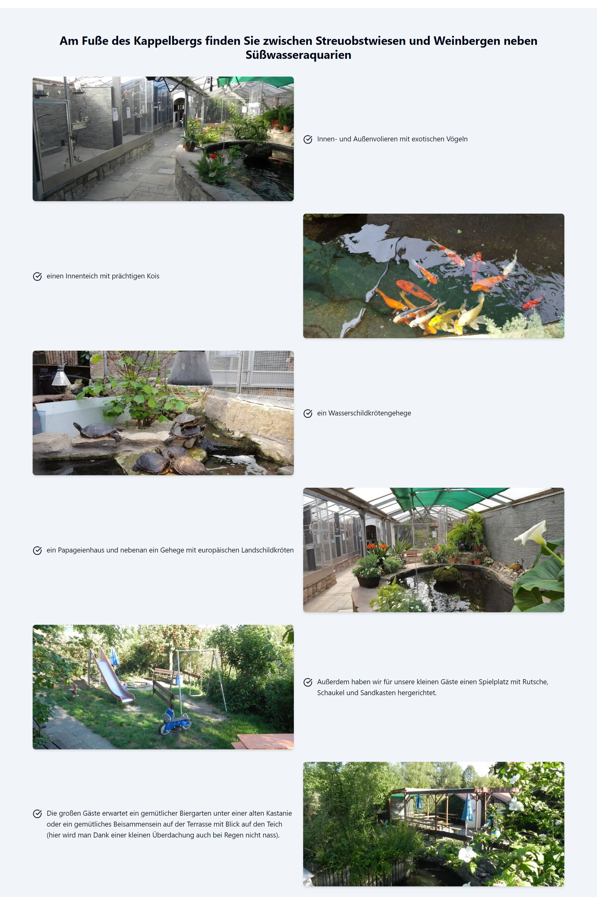
    </td>
    <td width="50%">
      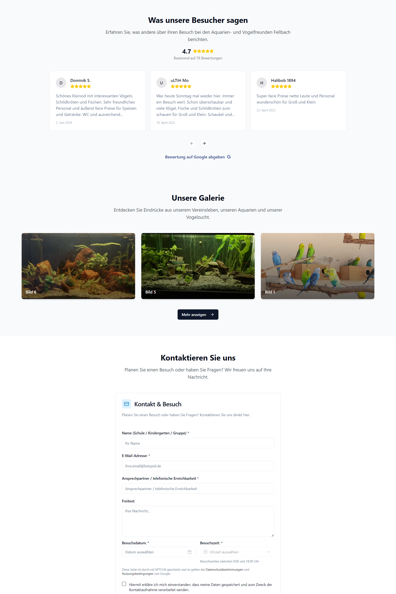
    </td>
  </tr>
</table>

### Mobile Experience

<table>
  <tr>
    <td width="25%" align="center">
      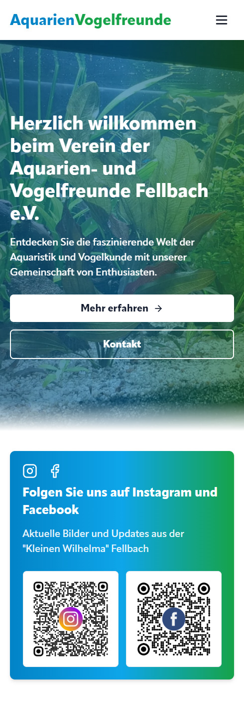
    </td>
    <td width="25%" align="center">
      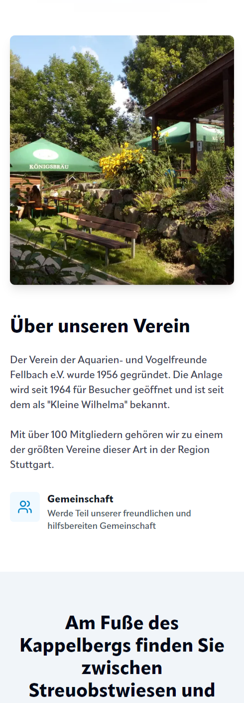
    </td>
    <td width="25%" align="center">
      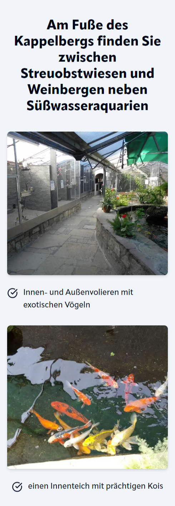
    </td>
    <td width="25%" align="center">
      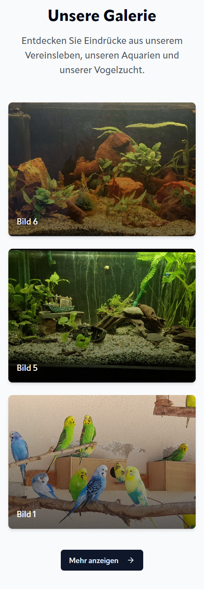
    </td>
  </tr>
</table>

### Events & Gallery

<table>
  <tr>
    <td width="50%">
      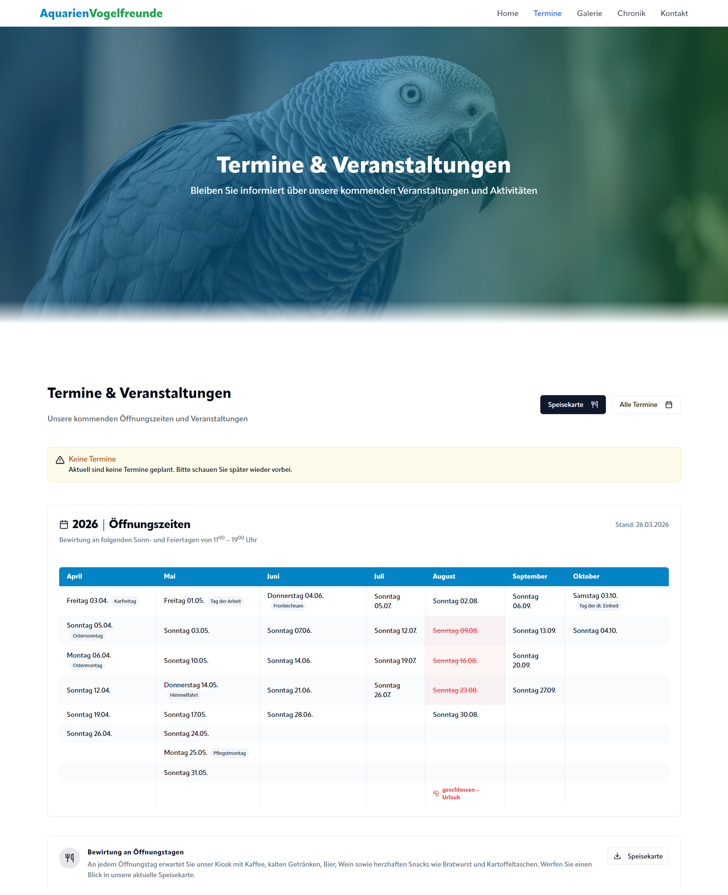
    </td>
    <td width="50%">
      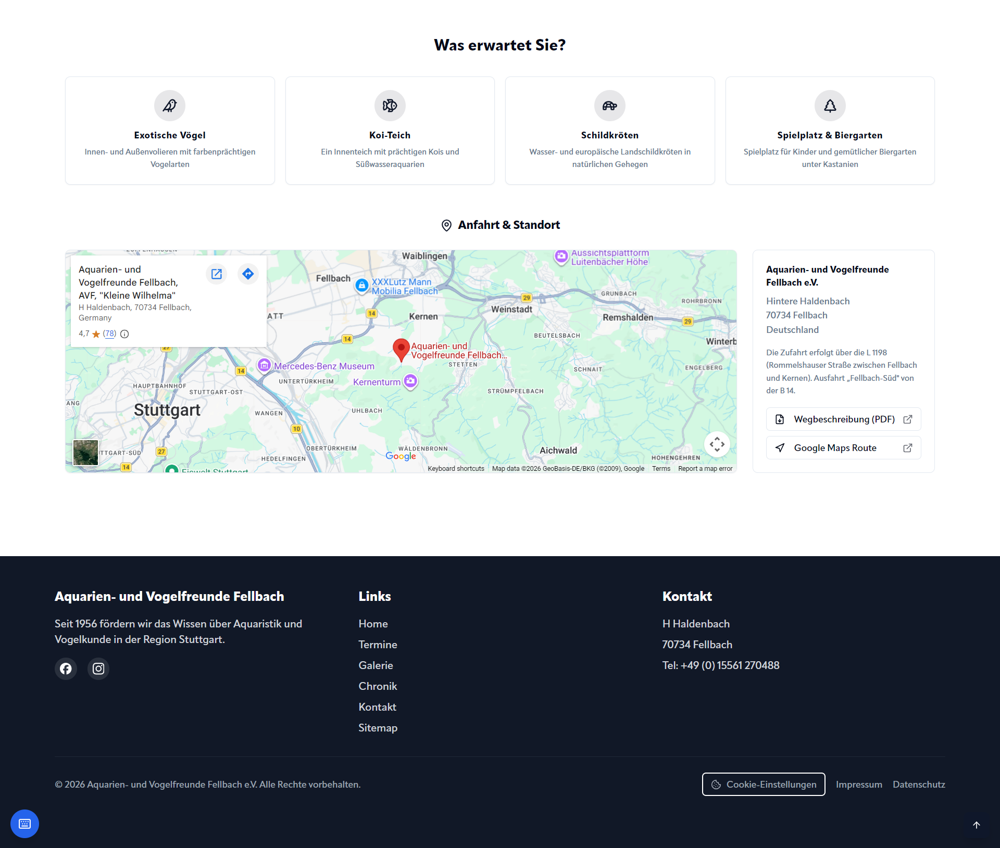
    </td>
  </tr>
</table>

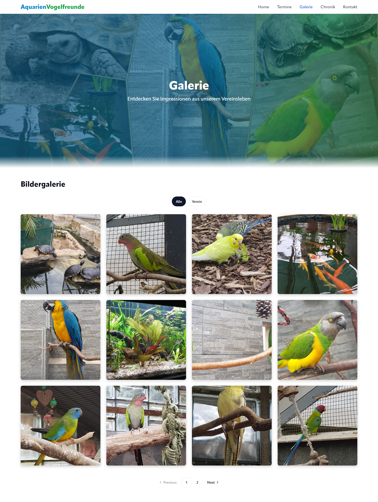

### Admin Dashboard

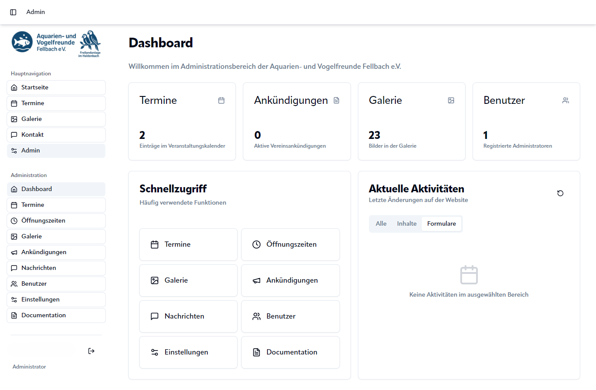

---

## What This Project Demonstrates

- Creating a professional website for a local association
- Building a responsive React application with public and protected areas
- Planning and implementing admin/dashboard workflows
- Structuring event, gallery and chronicle content
- Supporting volunteer teams with self-manageable content tools
- Working with Supabase auth, storage and backend direction
- Combining accessibility, privacy and practical association needs
- Presenting a private pro-bono project publicly as a case study

---

## Repository Purpose

This repository is intentionally a **case-study repository**.

It does not contain the private production code. Instead, it documents the project concept, goals, features, design direction and technical approach in a professional way for portfolio, GitHub and freelance platform presentation.

---

## Contact

**Portfolio:** [https://aysek.dev](https://aysek.dev)  
**GitHub:** [AydanKara](https://github.com/AydanKara)

---

<div align="center">

**Modern Web Development by aysek.dev**

</div>
